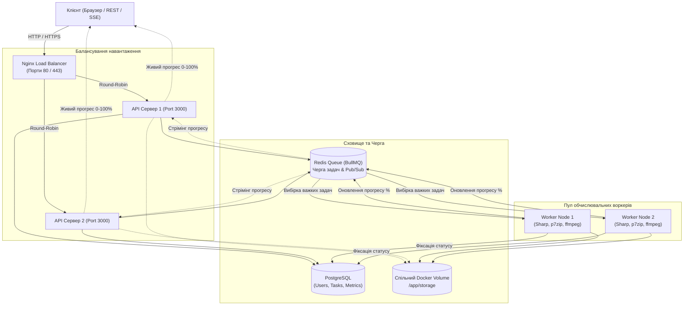

# Cloud Media Converter & Archiver

Розподілена веб-система для обробки ресурсомістких (CPU-bound) задач користувачів: конвертації медіафайлів, важкої архівації та стрес-бенчмаркінгу з балансуванням навантаження та пулом асинхронних воркерів.

Розроблено відповідно до технічного завдання [docs/TASK.txt](docs/TASK.txt).

---

## Архітектура системи

Система побудована на мікросервісній контейнеризованій архітектурі з єдиною точкою входу через балансувальник навантаження:



Детальніше про проектування читайте у [docs/ARCHITECTURE.md](docs/ARCHITECTURE.md).

---

## Відповідність вимогам (TASK.txt)

- [x] **Обмеження трудомісткості:** клієнтська перевірка розміру файлу, таймаут на сервері (120 с), ліміт задач на клієнта.
- [x] **Балансування навантаження (Ключове):** Nginx розподіляє трафік між `api1` та `api2` (заголовки `X-Served-By` та `X-Handled-By`).
- [x] **Захищене з'єднання (HTTPS):** робота через SSL/TLS (порт 443).
- [ ] **Інформування про хід виконання:** живий прогрес-бар (0-100%) та етапи через SSE.
- [ ] **Історія задач та скасування:** збереження результатів у БД, можливість примусового переривання задачі.
- [ ] **Черга очікування з ETA (+бали):** розрахунок приблизного часу очікування при зайнятості воркерів.
- [ ] **Горизонтальне масштабування (+бали):** динамічний запуск нових воркерів при зростанні черги.
- [ ] **Адмін-панель (+бали):** моніторинг навантаження CPU/RAM, активних процесів та стану серверів.

---

## Стек технологій

* **Балансувальник:** Nginx (Alpine) + автоматична генерація SSL сертифікатів
* **Бекенд:** Node.js, Express, TypeScript
* **Черга задач:** Redis 7 + BullMQ
* **База даних:** PostgreSQL 16 + Prisma ORM
* **Медіа & Архіви:** Sharp, p7zip, tar, FFmpeg
* **Контейнеризація:** Docker Compose

---

## Швидкий запуск

### 1. Передумови
Переконайтеся, що на вашому комп'ютері встановлено та запущено **Docker Desktop**.

### 2. Запуск кластера
```bash
# Клонувати репозиторій та перейти в папку
cd web-project

# Запустити всі сервіси у фоновому режимі
docker compose up --build -d
```

### 3. Перевірка працездатності
Після запуску доступні такі ендпоінти:

* **Перевірка балансувальника (HTTP):** [http://localhost/health](http://localhost/health)
  *(Оновіть сторінку декілька разів, щоб побачити перемикання між `API_SERVER_1` та `API_SERVER_2`)*
* **Перевірка HTTPS:** [https://localhost/health](https://localhost/health)
* **Статус БД та Redis:** [http://localhost/api/status](http://localhost/api/status)

---

## Корисні команди

| Дія | Команда |
| :--- | :--- |
| **Зупинити кластер** | `docker compose down` |
| **Переглянути статус контейнерів** | `docker compose ps` |
| **Переглянути логи всіх серверів** | `docker compose logs -f` |
| **Переглянути логи конкретного воркера** | `docker compose logs -f worker1` |
| **Синхронізувати схему Prisma з БД** | `docker compose exec api1 npx prisma db push` |

---

## Структура проєкту

```text
web-project/
├── backend/            # Вихідний код бекенду (API сервери та воркери)
│   ├── prisma/         # Схема бази даних (schema.prisma)
│   ├── src/            # TypeScript код (контролери, черга, сервіси)
│   ├── Dockerfile      # Мультистейдж Dockerfile з p7zip та ffmpeg
│   └── package.json
├── nginx/              # Конфігурація балансувальника та SSL
│   ├── Dockerfile
│   └── nginx.conf
├── docs/               # Технічне завдання та архітектура
├── tasks/              # План розробки (plan.md, todo.md)
├── skills/             # Інженерні інструкції розробки
├── docker-compose.yml  # Оркестрація всіх 7 контейнерів
└── README.md
```
